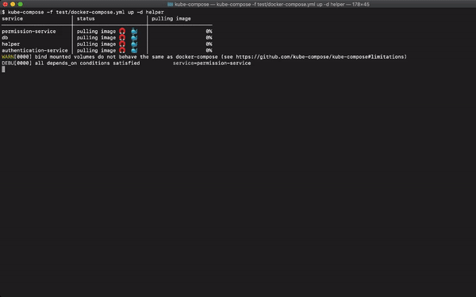

[](https://dl.circleci.com/status-badge/redirect/circleci/WUufkK7NNgafZsXX9AUM9B/CoAmWRbb8443DV3gwBzz3D/tree/main)
[](https://github.com/kube-compose/kube-compose/blob/master/LICENSE.md)
[](https://coveralls.io/github/jubr/kube-compose?branch=master?r=6)

# kube-compose

kube-compose creates and destroys environments in Kubernetes based on docker compose files with an emphasis on CI use cases.



# Contents

* [Installation](#Installation)
  * [Manual installation](#Manual-installation)
* [Getting Started](#Getting-Started)
* [Examples](#Examples)
  * [Waiting for startup and startup order](#Waiting-for-startup-and-startup-order)
  * [Volumes](#Volumes)
    * [Limitations](#Limitations)
  * [Running containers as specific users](#Running-containers-as-specific-users)
  * [Dynamic test configuration](#Dynamic-test-configuration)
* [User guide](#User-guide)
  * [Known limitations](#Known-limitations)
  * [x-kube-compose](#x-kube-compose)
    * [Merging](#Merging)
* [Developer information](#Developer-information)

# Installation
## Using Homebrew
Add the tap:
```bash
brew tap kube-compose/homebrew-kube-compose
```
Install `kube-compose`:
```bash
brew install kube-compose
```
To upgrade `kube-compose` to the latest stable version:
```bash
brew upgrade kube-compose
```

## Manual installation
Download the binary from https://github.com/kube-compose/kube-compose/releases, ensure it has execute permissions and place it on your `PATH`.

# Getting Started
`kube-compose` targets a Kubernetes namespace, and will need a running Kubernetes cluster and [a kube config file](https://kubernetes.io/docs/concepts/configuration/organize-cluster-access-kubeconfig/). If you do not have a running Kubernetes cluster, consider running one locally using:
1. [Docker Desktop](https://www.docker.com/products/docker-desktop)
2. [Minikube](https://kubernetes.io/docs/setup/minikube/)

`kube-compose` loads Kubernetes configuration the same way [`kubectl`](https://kubernetes.io/docs/tasks/tools/install-kubectl/) does.

To run `kube-compose` with [the test docker-compose.yml](test/docker-compose.yml):
```bash
kube-compose -f'test/docker-compose.yml' -e'myuniquelabel' up
```
The `-e` flag sets a unique identifier that is used to isolate [labels and selectors](https://kubernetes.io/docs/concepts/overview/working-with-objects/labels/) and ensure names are unique when deploying to shared namespaces. This is ideal for CI where many jobs and test environments run simultaneously. The command will wait for pods and stream their logs to stdout. When run on a terminal, use <kbd>ctrl</kbd> + <kbd>c</kbd> to return control to the terminal.

Similar to `docker-compose`, an environment can be stopped and destroyed using the `down` command: 
```bash
kube-compose -f'test/docker-compose.yml' -e'myuniquelabel' down
```

The CLI of `kube-compose` mirrors `docker-compose` as much as possible, but has some differences.

To avoid repeating the `-e` flag you can use the environment variable `KUBECOMPOSE_ENVID`. The above two commands can also be written as:
```bash
cd test
export KUBECOMPOSE_ENVID='myuniquelabel'
kube-compose -f'test/docker-compose.yml' up
```
and
```bash
kube-compose -f'test/docker-compose.yml' down
```

For a full list of options and commands, run the help command:
```bash
kube-compose --help
```

# Examples
This section shows several examples of how `kube-compose` supports common CI use cases, in particular the following common system testing steps:
1. Start environment
2. Wait until the environment has fully started
3. Run tests
4. Stop environmnent

## Waiting for startup and startup order
When performing system testing in CI, waiting until an application and any stubs/dependencies are ready is common task. `kube-compose` supports ordered startup and readiness waiting through [depends_on](https://docs.docker.com/compose/compose-file/compose-file-v2/#depends_on) with `condition: service_healthy` and healthchecks. This approach is powerful, because it does not require writing complicated startup scripts. NOTE: version 3 docker compose files do not support `depends_on` conditions anymore (see https://docs.docker.com/compose/startup-order/).

For example, if `docker-compose.yml` is...
```yaml
version: '2.4'
services:
  web:
    image: web:latest
    depends_on:
      db:
        condition: service_healthy
  db:
    image: db:latest
  helper:
    image: ubuntu:latest
    depends_on:
      web:
        condition: service_healthy
```
...then...
```bash
kube-compose up -d 'helper'
```
...will create the environment and wait for the environment to be fully started. The service `helper` is used to to make sure that `web` is healthy as soon as `kube-compose` returns, so that the environment can be immediately used after the `up` command returns (e.g. to run system testing).

NOTE: in the background `kube-compose` converts [Docker healthchecks](https://docs.docker.com/engine/reference/builder/#healthcheck) to [readiness probes](https://kubernetes.io/docs/tasks/configure-pod-container/configure-liveness-readiness-probes/) and will only start service `web` when the pod of `db` is ready, and will only start `helper` when the pod of `web` is ready. The pod of `helper` exits immediately, but this pattern is simple and useful. 

## Volumes
`kube-compose` currently supports basic simulation of docker's bind mounted volumes. This supports the use case of mounting configuration files into containers, which is a common way of parameterising containers.

For example, consider the following docker compose file:
```yaml
version: '2.4'
services:
  volumedemo:
    image: 'ubuntu:latest'
    entrypoint:
    - /bin/bash
    - -c
    - |
      echo 'Inception...'
      cat /mnt/inception
    volume:
    - './docker-compose.yml:/mnt/inception:ro'
x-kube-compose:
  cluster_image_storage:
    type: 'docker'
  volume_init_base_image: 'ubuntu:latest'
```
It describes a service that prints the contents of the host file `./docker-compose.yml`, using a bind mounted volume. When `kube-compose`'s `up` command is run against the above file, `kube-compose` simulates the bind mounted volume by:
1. Building a helper image with the relevant host files (in this case only `./docker-compose.yaml`);
1. Running the helper image as an [initContainer](https://kubernetes.io/docs/concepts/workloads/pods/init-containers/) that initialises an [emptyDir](https://kubernetes.io/docs/concepts/storage/volumes/) volume; -and
1. Mounting the emptyDir volume into the main container at the configured mount path.

The additional `x-kube-compose` configuration is required so that:
1. `kube-compose` knows where to store docker images so that the Kubernetes cluster can run them.
2. `kube-compose` knows which base image to use for helper images.

NOTE1: the `x-` is the prefix for extensions, standardized in docker-compose.

NOTE2: a `cluster_image_storage` with `type: docker` typically only works with [Docker Desktop](https://www.docker.com/products/docker-desktop)'s Kubernetes cluster. See [this section](#x-kube-compose) on how to configure other clusters.

### Limitations
1. Volumes that are not bind mounted volumes are ignored.
1. If a docker compose service makes changes in a mount of a bind mounted volume then those changes will not be reflected in the host file system, and vice versa.
1. If docker compose services `s1` and `s2` have mounts `m1` and `m2`, respectively, and `m1` and `m2` mount overlapping portions of the host file system, then changes in `m1` will not be reflected in `m2` (if `c1=c2` then this can be implemented easily by mounting the same volume multiple times).

The third limitation implies that sharing volumes between two docker compose services is not supported, even though this could be implemented through persistent volumes.

## Running containers as specific users
Docker images and stubs run in CI often cannot be easily modified because they are provided by a third party, and the cluster's pod security policy can deny images from being run with the correct user. For this reason, `kube-compose` allows you to use the `--run-as-user` flag:
```bash
kube-compose up --run-as-user
```
This will set each pod's `runAsUser` (and `runAsGroup`) based on the [`user` property](https://docs.docker.com/compose/compose-file/#domainname-hostname-ipc-mac_address-privileged-read_only-shm_size-stdin_open-tty-user-working_dir) of the `docker-compose` service and the [`USER` configuration](https://docs.docker.com/engine/reference/builder/#user) of the docker image. Consequently, additional privileges are required by the deployer when this flag is set, but it is an easy way of making CI "just work".

NOTE1: if a Dockerfile does not have a `USER` instruction, then the user is inherited from the base image. This makes it very easy to run images as root.

NOTE2: at first glance this is a useless feature, because if the deployer has permissions to create pods running as any user then the user of the image is respected already. But the `user` property of a `docker-compose` service can only be properly implemented by setting `runAsUser` (and `runAsGroup`), and the `--run-as-user` flag will enable early errors when the deployer has insufficient permissions.

## Dynamic test configuration
When running tests against a dynamic environment that runs in a shared namespace, the test configuration will need to be generated. `kube-compose` has a `get` command that prints the `.svc` hostnames of services.

Suppose for example that a `docker-compose` service named `my-service` has been deployed to a Kubernetes namespace named `mynamespace`, and the environment id was set to `myenv`. Then the command...
```bash
kube-compose -e'myenv' get 'my-service' -o'{{.Hostname}}'
```
...will output...
```bash
my-service-myenv.mynamespace.svc.cluster.local
```
NOTE: a Kubernetes service will only be created for `docker-compose` services that have ports.

# User guide
## Known limitations
1. The `up` subcommand does not build images of `docker-compose` services if they are not present locally ([#188](https://github.com/kube-compose/kube-compose/issues/188)).
1. Volumes: see [this section](#Limitations).

## x-kube-compose
`x-kube-compose` is an additional configuration section in docker compose files. It is required by `kube-compose`'s simulation of bind mounted volumes (see [Volumes](#Volumes)), and it can also be set to make `kube-compose` push images to a different docker registry as part of deployments. For example, consider the following docker compose file:
```yaml
version: '3'
services:
    service1:
        image: 'docker-registry.example.com/ubuntu:latest'
x-kube-compose:
    cluster_image_storage:
        type: 'docker_registry'
        host: 'docker-registry.openshift-cluster.example.com'
    volume_init_base_image: 'docker-registry.example.com/ubuntu:latest'
```
The `volume_init_base_image` configuration item specifies the base image of helper images built to implement bind mounted volumes. This option is useful for corporate networks that do not have a proxy or docker registry mirror available. The base image must have `bash` and `cp` installed.

The `cluster_image_storage` configuration item includes the field `type` which must be either `docker` or `docker_registry`, denoting a docker daemon or a docker registry. The former can be used when deploying to [Docker Desktop's cluster](https://docs.docker.com/docker-for-mac/kubernetes/). The latter also implies that a field `host` (the host of the docker registry) must be included.

Currently `kube-compose` can only push to docker registries that are configured like OpenShift's default docker registry. In particular, `kube-compose` makes the following assumptions when the image storage location is a docker registry:
1. Within the cluster the hostname of the docker registry is assumed to be `docker-registry.default.svc:5000`.
1. The kube configuration is assumed to have bearer token credentials, that are supplied as the password to the docker registry (the username will be `unused`). If the docker registry is unauthenticated then this authentication should be ignored.
1. References to pushed images have the form `<registry>/<project>/<imagestream>:latest`, [as required by OpenShift](https://blog.openshift.com/remotely-push-pull-container-images-openshift/).

### Merging
When specifying multiple files on the command line, the `x-kube-compose` section will also be merged.

# Developer information

## Building
```bash
go build .
```

## Linting
Install the linter if you do not have it already:
```bash
brew install golangci-lint
```
Run the linter:
```bash
golangci-lint run --deadline=30m
```

## Unit testing
To run unit tests:
```bash
go test ./...
```
To run unit tests with code coverage:
```bash
go test -coverpkg=./... -coverprofile=coverage.out ./...
go tool cover -html=coverage.out
```

## Testing
Use `kubectl` to set the target Kubernetes namespace and the service account of kube-compose.

Run `kube-compose` with the test [docker-compose.yml](test/docker-compose.yml):
```bash
kube-compose -f test/docker-compose.yml --env-id test123 up
```

To clean up after the test:
```bash
kube-compose down
```
